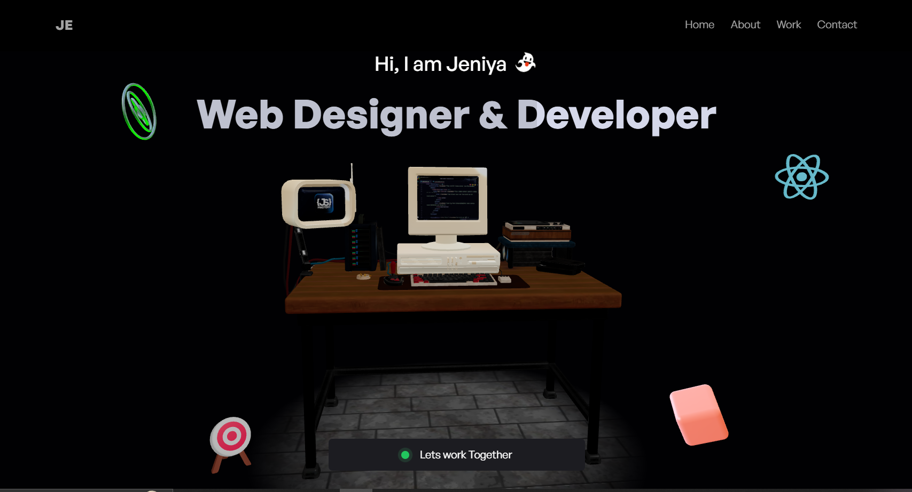

# 3D Minimalistic Portfolio

A visually stunning and interactive portfolio showcasing creativity and technical skills using cutting-edge web technologies.

---

## 🚀 Features
- **Immersive Hero Section**: 
  - A captivating 3D hacker room that reacts to mouse movements, surrounded by animated mini-models.
- **Interactive About Me**:
  - A grid layout displaying personal details.
  - A dynamic 3D globe pinpointing your location.
- **Dynamic Project Showcase**:
  - Explore projects with live demos displayed inside a 3D computer model.
  - Seamlessly switch between projects.
- **Engaging Experience Timeline**:
  - Hover over career milestones to trigger interactive 3D animations.
- **Easy Contact Form**:
  - A user-friendly email form to allow visitors to reach you directly.
- **Fully Responsive**:
  - Optimized for all devices, from desktops to mobiles.

---

## 🛠️ Tech Stack
- **React.js**
- **Three.js**
- **React Three Fiber**
- **React Three Drei**
- **TailwindCSS**
- **EmailJS**
- **Vite**

---

## 🙌 Acknowledgments
This project was inspired by the amazing tutorials from the YouTube channel [JavaScript Mastery](https://www.youtube.com/@javascriptmastery).

---

Enjoy exploring the 3D Minimalistic Portfolio! 🚀
